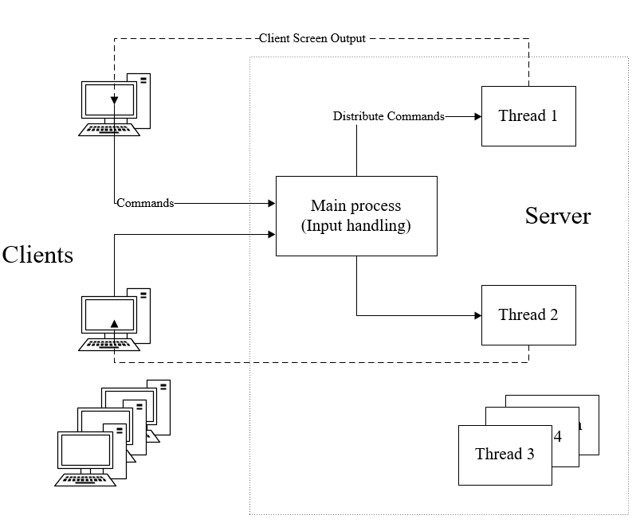

# Unix-like-FileSystem [MultiUser]
Course project for Operating System in Tongji University.
## Multi-user Structure

## Requirements
- Microsoft Visual C++ >= 11.0
## Usage
- Client and server(filesystem) are two programs. For the client to function properly, the server should be launched.
- Before use for the first time, run `fformat` to generate `MyDisk.img`.
```
fformat
```
- Run `cd` command to change the directory.
```
cd [dir]
```
- Run `mkdir` command to make a directory.
```
mkdir [dir]
```
- To list all files of the current directory, run:
```
ls
``` 
- Run `fopen` to open a file. If success, the file id `fd` will be provided.
```
fopen [dir]
```
- Run `fcreate` to create a file.
```
fcreate [dir]
```
- Run `fclose` to close a file.
```
fclose [fd]
```
- To read bytes of a file, run:
```
fread [fd] [nbytes]
```
- To write bytes to a file, run:
```
fwrite [fd] [nbytes] [string]
```
- To relocate the read-write pointer of a file, run:
```
fseek [fd] [offset] [ptrname]
```
- Run `fdelete` to delete a file:
```
fdelete [dir]
```
- To copy a file from Windows to the disk, run:
```
fmount [dir1] [dir2]
```
- To quit the file system, run:
```
quit
```
## Future Work

- 全方面测试
- 提高线程安全
- 规避内存泄漏
- 增加指令种类（从系统中转出文件）
- 进一步完善系统（如不能删除当前目录的父目录）
- 进一步提升多用户体验
